

  

<h1 align="center">
  SE Blueprinter
</h1>

  SE Blueprinter is an online tool to convert 3D models into Space Engineers blueprints.

  Try it now at https://imivi.github.io/se-blueprinter

## Features

* Supports both cubes and sloped blocks (full list below)
* Choose between **large**/**small** grids, and **heavy**/**light** armor
* Make meshes **hollow**

## How to use

1. Upload your 3d model. The format must by **GLTF binary** (`.glb` extension). If you have an STL or another format you can use [Blender](https://www.blender.org/) to convert it to .glb
1. Pick between **large/small** grid, **heavy/light** armor, and **static/ship** grid.
1. Optionally, enter your player information
1. Create the blueprint preview. You can view the generated preview layer by layer.
1. Download the blueprint as a zip file. Unzip it and place the folder inside the SE blueprints folder. By default it's `C:/Users/<YOUR_USERNAME>/AppData/Roaming/SpaceEngineers/Blueprints/local/`

## Caveats & tips

Here's a few tips to achieve the best results using SE Blueprinter.

### Tip #1: apply transformations and modifiers

**Before exporting** your 3D model, make sure to:

* apply **rotation and scale** to all meshes! (in Blender: select meshes > `CTRL+A` > `Rotation & Scale`)
* apply **modifiers** to all meshes (in the Blender export dialog: `Data` > `Mesh` > `Apply Modifiers`)

### Tip #2: orient faces outward

SE Blueprinter relies on face normals (i.e. the direction that the faces are facing) to detect where blocks should go, so if the normals are wrong you may end up with missing blocks.

To fix this, make sure that all mesh faces are oriented outward. This is easy in Blender:

* Select the mesh
* Enter edit mode (tab)
* Show normals: in `Mesh edit mode`, click on the icon for `Display normals` and increase the `size` slider:

  

* Still in edit mode, select all faces (shortcut: `A`)
* hit `mesh` > `normals` > `recalculate outside`

  

### Tip #3: simplify your meshes

Removing unnecessary faces, edges and vertices can improve both accuracy and performance.

1. Select a mesh
2. Enter edit mode (tab)
3. Select all faces (shortcut: `A`)
3. hit `mesh` > `delete` > `limited dissolve`

Compare before and after:

More info: https://docs.blender.org/manual/en/latest/modeling/meshes/editing/mesh/delete.html#limited-dissolve

### Tip #4: design your meshes as solids

For the best results, every mesh should be "watertight" or "solid", meaning that all mesh faces create a single continuous surface with no gaps or holes, thus the back of these faces is never visible from the outside. This kind of mesh is also called "manifold".

### Tip #5: 1 meter = 1 block

In Space Engineers, the size of a large block is 2.5m, and a small block is 0.5m. However, SE Blueprinter treats **1m as 1 block**, regardless of the grid size you pick.

## FAQ

> The blueprint is missing some blocks / it has blocks that should not be there

* Make sure the face normals of the 3D model are facing outwards
* Try changing the raycast direction before generating the blueprint
* Try splitting the model into multiple meshes, as this can improve accuracy as well as performance

> Is this tool safe to use? Are my blueprints being uploaded somewhere?

SE Blueprinter runs entirely in your browser, so all your data stays private.

## Supported blocks

**Only armor blocks are supported**.

| Block                                                                 | Name                    | Supported? |
| --------------------------------------------------------------------- | ----------------------- | ---------- |
| 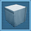                                     | block                   | ✔️         |
| 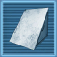                                     | slope                   | ✔️         |
| 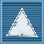                                   | corner                  | ✔️         |
|                            | inv corner              | ✔️         |
| 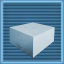                                       | half                    | ✔️         |
| 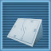                           | half slope              | ✔️         |
| 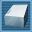                   | slope 211 base          | ✔️         |
| 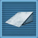                     | slope 211 tip           | ✔️         |
| 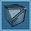         | inv corner 211 base     | ✔️         |
|            | inv corner 211 tip      | ✔️         |
| 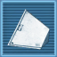                 | corner 211 base         | ✔️         |
|                    | corner 211 tip          | ✔️         |
|                      | corner square           | ✔️         |
|              | corner square inv       | ✔️         |
|                          | half corner             | ✔️         |
|              | half slope corner       | ✔️         |
|      | half slope corner inv   | ✔️         |
|            | half sloped corner      | ✔️         |
|  | half sloped corner base | ✔️         |
|                    | half slope inv          | ✔️         |
|                      | sloped corner           | 🚧 to be added         |
|            | sloped corner base      | 🚧 to be added         |
|              | sloped corner tip       | 🚧 to be added         |
| 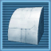                         | round slope             | ❌         |
|                        | round corner            | ❌         |
| 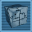               | round inv corner        | ❌         |

## Acknowledgements

* [three-mesh-bvh](https://github.com/gkjohnson/three-mesh-bvh) for improving raycasting performance
* https://polyhaven.com/a/pizzo_pernice_puresky for the background environment map

## For developers

### Add more blocks

1. Edit `src/blocks/block-names.csv` and add the names for the new blocks
2. run `npm run save-block-names` to convert the csv to json (src/blocks/block-names.json)
3. Edit `src/models/blocks.blend` adding the blocks in all orientations
4. Export to `public/cubes.glb`
5. Re-create the block signatures (steps below)

### Create block signatures

1. Run the webapp in debug mode: http://localhost:5173/se-blueprinter?debug=true
2. Load any example model
3. Select "slopes (fast)" scan mode
4. In the debug panel, click on `copy signatures`
5. Paste the signatures in `src/blocks/block-signatures-3x3x3.json`
6. Switch to "slopes (best)" scan mode
7. Again `copy signatures`
8. Paste the signatures in `src/blocks/block-signatures-4x4x4.json`